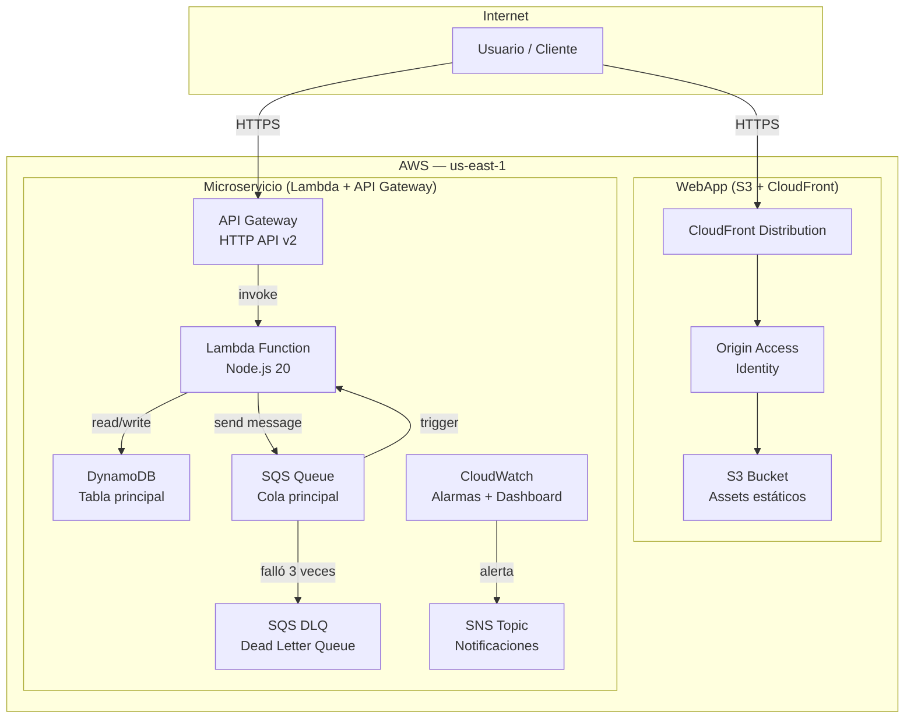
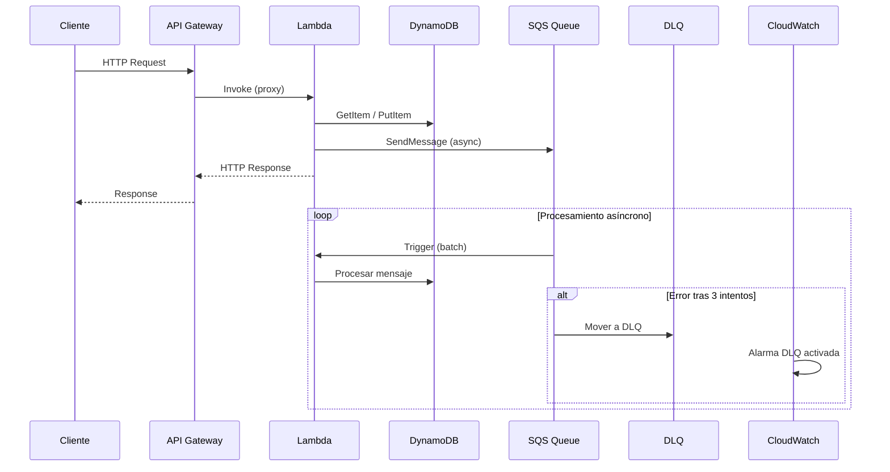

# Documentación de Infraestructura

> Kiro DevOps Workshop — Stack AWS con Terraform

---

## Tabla de Contenidos

1. [Arquitectura General](#arquitectura-general)
2. [Arquitectura del Microservicio](#arquitectura-del-microservicio)
3. [Módulos Terraform](#módulos-terraform)
4. [Variables por Ambiente](#variables-por-ambiente)
5. [Convención de Nombres](#convención-de-nombres)
6. [Proceso para Agregar Nuevos Recursos](#proceso-para-agregar-nuevos-recursos)
7. [Estructura de Directorios](#estructura-de-directorios)

---

## Arquitectura General



---

## Arquitectura del Microservicio



---

## Módulos Terraform

### Módulo `webapp`

**Ruta:** `infra/terraform/modules/webapp/`

Crea la infraestructura para servir activos estáticos con CDN global.

| Recurso | Descripción |
|---------|-------------|
| `aws_s3_bucket` | Bucket privado con versionado habilitado |
| `aws_cloudfront_origin_access_identity` | OAI para acceso seguro desde CloudFront |
| `aws_cloudfront_distribution` | CDN con redirect HTTP→HTTPS y cache configurable |
| `aws_s3_bucket_policy` | Política que restringe acceso solo a la OAI |

**Variables requeridas:**

| Variable | Tipo | Descripción |
|----------|------|-------------|
| `project_name` | `string` | Nombre del proyecto (max 32 chars) |
| `environment` | `string` | `dev`, `staging` o `production` |

**Variables opcionales:**

| Variable | Default | Descripción |
|----------|---------|-------------|
| `bucket_name` | `""` | Nombre del bucket (auto-generado si vacío) |
| `custom_domain` | `""` | Dominio personalizado para CloudFront |
| `certificate_arn` | `""` | ARN del certificado ACM (requerido con dominio custom) |
| `enable_logging` | `false` | Habilitar logging de accesos |
| `tags` | `{}` | Tags adicionales |

---

### Módulo `microservice/lambda`

**Ruta:** `infra/terraform/modules/microservice/lambda/`

Crea la función Lambda y el API Gateway HTTP API v2 que la expone.

| Recurso | Descripción |
|---------|-------------|
| `aws_lambda_function` | Función principal del microservicio |
| `aws_iam_role` | Rol de ejecución con permisos a DynamoDB y SQS |
| `aws_iam_role_policy` | Política inline con permisos mínimos necesarios |
| `aws_apigatewayv2_api` | HTTP API (protocolo HTTP, más económico que REST) |
| `aws_apigatewayv2_stage` | Stage con auto-deploy activado |
| `aws_apigatewayv2_integration` | Integración proxy con la Lambda |
| `aws_apigatewayv2_route` | Ruta catch-all `$default` |
| `aws_cloudwatch_log_group` | Grupos de logs para Lambda y API Gateway |

**Variables requeridas:**

| Variable | Tipo | Descripción |
|----------|------|-------------|
| `project_name` | `string` | Nombre del proyecto |
| `environment` | `string` | Ambiente de despliegue |

**Variables opcionales destacadas:**

| Variable | Default | Descripción |
|----------|---------|-------------|
| `lambda_filename` | `lambda.zip` | Ruta al ZIP del código |
| `lambda_handler` | `index.handler` | Handler de la función |
| `lambda_runtime` | `nodejs20.x` | Runtime (nodejs20.x, nodejs18.x, python3.11/3.12) |
| `lambda_memory_mb` | `256` | Memoria en MB (128–10240) |
| `lambda_timeout_seconds` | `30` | Timeout en segundos (1–900) |
| `dynamodb_table_arn` | `""` | ARN de DynamoDB para permisos IAM |
| `sqs_queue_arn` | `""` | ARN de SQS para permisos IAM |
| `environment_variables` | `{}` | Variables de entorno de la Lambda |

---

### Módulo `microservice/dynamodb`

**Ruta:** `infra/terraform/modules/microservice/dynamodb/`

Crea la tabla DynamoDB con configuración de seguridad y rendimiento.

| Recurso | Descripción |
|---------|-------------|
| `aws_dynamodb_table` | Tabla con cifrado en reposo (SSE) y PITR |

**Variables requeridas:**

| Variable | Tipo | Descripción |
|----------|------|-------------|
| `project_name` | `string` | Nombre del proyecto |
| `environment` | `string` | Ambiente de despliegue |

**Variables opcionales destacadas:**

| Variable | Default | Descripción |
|----------|---------|-------------|
| `hash_key` | `id` | Nombre del partition key |
| `hash_key_type` | `S` | Tipo: `S`, `N` o `B` |
| `range_key` | `""` | Nombre del sort key (opcional) |
| `billing_mode` | `PAY_PER_REQUEST` | `PAY_PER_REQUEST` o `PROVISIONED` |
| `enable_ttl` | `false` | Habilitar expiración automática |
| `ttl_attribute` | `expires_at` | Atributo de TTL |
| `enable_point_in_time_recovery` | `true` | Restauración point-in-time |
| `global_secondary_indexes` | `[]` | Lista de GSIs |

---

### Módulo `microservice/sqs`

**Ruta:** `infra/terraform/modules/microservice/sqs/`

Crea la cola principal SQS y su Dead Letter Queue con redrive policy.

| Recurso | Descripción |
|---------|-------------|
| `aws_sqs_queue` (main) | Cola principal con long polling |
| `aws_sqs_queue` (dlq) | Dead Letter Queue para mensajes fallidos |
| `aws_sqs_queue_policy` | Política que autoriza a la cola principal enviar a la DLQ |
| `aws_lambda_event_source_mapping` | Trigger Lambda desde SQS (opcional) |

**Variables requeridas:**

| Variable | Tipo | Descripción |
|----------|------|-------------|
| `project_name` | `string` | Nombre del proyecto |
| `environment` | `string` | Ambiente de despliegue |

**Variables opcionales destacadas:**

| Variable | Default | Descripción |
|----------|---------|-------------|
| `visibility_timeout_seconds` | `30` | Debe ser ≥ timeout de Lambda |
| `message_retention_seconds` | `86400` | Retención en cola (1 día) |
| `max_receive_count` | `3` | Intentos antes de ir a DLQ |
| `dlq_message_retention_seconds` | `604800` | Retención en DLQ (7 días) |
| `lambda_function_arn` | `""` | ARN de Lambda para event source mapping |
| `lambda_batch_size` | `10` | Mensajes por invocación |
| `enable_fifo` | `false` | Cola FIFO con orden garantizado |

---

### Módulo `microservice/alarmas`

**Ruta:** `infra/terraform/modules/microservice/alarmas/`

Crea alarmas de CloudWatch para monitorear Lambda, API Gateway y SQS.

| Recurso | Descripción |
|---------|-------------|
| `aws_cloudwatch_metric_alarm` | Alarmas para errores, latencia y throttles |
| `aws_cloudwatch_dashboard` | Dashboard unificado con todas las métricas |
| `aws_sns_topic` | Topic de notificaciones (opcional) |

**Alarmas creadas:**

| Alarma | Métrica | Umbral default |
|--------|---------|----------------|
| `lambda-errors` | Lambda Errors | ≥ 5 en 60s |
| `lambda-duration` | Lambda Duration p95 | ≥ 5000 ms |
| `lambda-throttles` | Lambda Throttles | ≥ 10 en 60s |
| `api-5xx-errors` | ApiGateway 5XXError | ≥ 10 en 60s |
| `api-latency` | ApiGateway IntegrationLatency p99 | ≥ 3000 ms |
| `dlq-messages` | SQS ApproximateNumberOfMessagesVisible | ≥ 1 |
| `queue-message-age` | SQS ApproximateAgeOfOldestMessage | ≥ 300s |

**Variables requeridas:**

| Variable | Tipo | Descripción |
|----------|------|-------------|
| `project_name` | `string` | Nombre del proyecto |
| `environment` | `string` | Ambiente de despliegue |
| `lambda_function_name` | `string` | Nombre de la Lambda a monitorear |

---

## Variables por Ambiente

### Diferencias entre ambientes

| Variable | `dev` | `staging` | `production` |
|----------|-------|-----------|--------------|
| `lambda_memory_mb` | 256 | 512 | 1024 |
| `lambda_timeout_seconds` | 30 | 30 | 15 |
| `billing_mode` (DynamoDB) | `PAY_PER_REQUEST` | `PAY_PER_REQUEST` | `PROVISIONED` |
| `lambda_error_threshold` | 5 | 3 | 1 |
| `lambda_duration_threshold_ms` | 10000 | 7000 | 3000 |
| `api_latency_threshold_ms` | 5000 | 3000 | 1500 |
| `dlq_message_retention_seconds` | 604800 | 604800 | 1209600 |
| `enable_point_in_time_recovery` | `true` | `true` | `true` |
| `create_sns_topic` | `true` | `true` | `false`* |

> \* En producción se recomienda usar un SNS topic centralizado pasado via `sns_topic_arn`.

### Variables de entorno Lambda por ambiente

| Variable | `dev` | `staging` | `production` |
|----------|-------|-----------|--------------|
| `NODE_ENV` | `development` | `staging` | `production` |
| `LOG_LEVEL` | `debug` | `info` | `warn` |

---

## Convención de Nombres

Todos los recursos siguen el patrón:

```
{project_name}-{environment}-{recurso}
```

### Ejemplos

| Recurso | Nombre generado |
|---------|-----------------|
| S3 Bucket | `kiro-workshop-dev-assets` |
| Lambda | `kiro-workshop-dev-microservice` |
| DynamoDB | `kiro-workshop-dev-table` |
| SQS Queue | `kiro-workshop-dev-queue` |
| SQS DLQ | `kiro-workshop-dev-dlq` |
| API Gateway | `kiro-workshop-dev-api` |
| IAM Role | `kiro-workshop-dev-lambda-exec-role` |
| CloudWatch Dashboard | `kiro-workshop-dev-dashboard` |
| CloudWatch Alarm | `kiro-workshop-dev-lambda-errors` |
| SNS Topic | `kiro-workshop-dev-alarmas` |
| Log Group Lambda | `/aws/lambda/kiro-workshop-dev-microservice` |
| Log Group API GW | `/aws/apigateway/kiro-workshop-dev-api` |

### Reglas

- Usar **lowercase** y guiones (`-`), nunca guiones bajos ni mayúsculas
- Máximo 32 caracteres para `project_name`
- Secrets de AWS: prefijo `CARVAJAL_` (ej: `CARVAJAL_AWS_ACCESS_KEY_ID`)
- Tags obligatorios en todos los recursos: `Project`, `Environment`, `ManagedBy`

---

## Proceso para Agregar Nuevos Recursos

### 1. Crear un nuevo módulo

```bash
mkdir -p infra/terraform/modules/<nombre-modulo>
touch infra/terraform/modules/<nombre-modulo>/{variables.tf,main.tf,outputs.tf}
```

Estructura mínima de cada archivo:

**`variables.tf`** — Incluir siempre `project_name` y `environment`:
```hcl
variable "project_name" {
  description = "Nombre del proyecto"
  type        = string
}

variable "environment" {
  description = "Ambiente (dev, staging, production)"
  type        = string
  validation {
    condition     = contains(["dev", "staging", "production"], var.environment)
    error_message = "El ambiente debe ser dev, staging o production."
  }
}
```

**`main.tf`** — Incluir bloque `terraform` con versiones:
```hcl
terraform {
  required_version = ">= 1.5.0"
  required_providers {
    aws = {
      source  = "hashicorp/aws"
      version = "~> 5.0"
    }
  }
}

locals {
  name_prefix = "${var.project_name}-${var.environment}"
  common_tags = merge(var.tags, {
    Project     = var.project_name
    Environment = var.environment
    ManagedBy   = "Terraform"
  })
}
```

### 2. Referenciar el módulo desde un entorno

En `infra/terraform/environments/{env}/main.tf`:

```hcl
module "mi_modulo" {
  source = "../../modules/<nombre-modulo>"

  project_name = local.project_name
  environment  = local.environment
  tags         = local.common_tags
}
```

### 3. Validar antes de hacer commit

```bash
# Verifica formato y sintaxis de todos los módulos
./scripts/validate-terraform.sh

# Corrige problemas de formato automáticamente
./scripts/validate-terraform.sh --fix
```

### 4. Verificar el plan antes de aplicar

```bash
cd infra/terraform/environments/dev
terraform init
terraform plan -out=tfplan
# Revisar el plan
terraform apply tfplan
```

### 5. Checklist antes de un PR

- [ ] `terraform fmt` sin errores
- [ ] `terraform validate` pasa en todos los módulos
- [ ] Variables documentadas con `description`
- [ ] Outputs con `description`
- [ ] Tags `Project`, `Environment`, `ManagedBy` en todos los recursos
- [ ] Nomenclatura sigue el patrón `{project}-{env}-{recurso}`
- [ ] Sin hardcode de ARNs, IDs ni credenciales

---

## Estructura de Directorios

```
infra/
├── cloudformation/
│   └── webapp.yaml                 # Template CloudFormation (alternativa a Terraform)
└── terraform/
    ├── environments/
    │   ├── dev/
    │   │   ├── main.tf             # Módulo webapp para dev
    │   │   └── microservice.tf     # Composición del microservicio para dev
    │   └── prod/                   # (pendiente de configurar)
    └── modules/
        ├── webapp/                 # S3 + CloudFront
        │   ├── main.tf
        │   ├── variables.tf
        │   └── outputs.tf
        └── microservice/
            ├── lambda/             # Lambda + API Gateway v2 + IAM
            │   ├── main.tf
            │   ├── variables.tf
            │   └── outputs.tf
            ├── dynamodb/           # Tabla DynamoDB
            │   ├── main.tf
            │   ├── variables.tf
            │   └── outputs.tf
            ├── sqs/                # Cola SQS + Dead Letter Queue
            │   ├── main.tf
            │   ├── variables.tf
            │   └── outputs.tf
            └── alarmas/            # CloudWatch Alarmas + Dashboard
                ├── main.tf
                ├── variables.tf
                └── outputs.tf

scripts/
└── validate-terraform.sh           # Script de validación para CI
```
